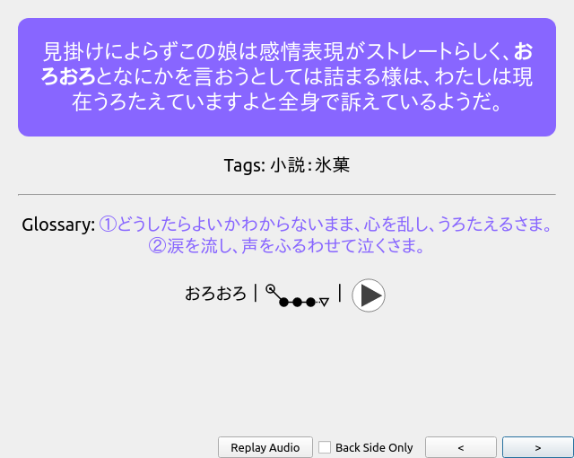
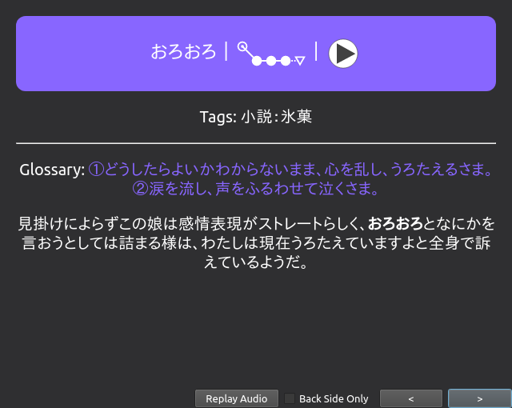

# Refold Japanese for Anki and Yomichan

Anki and Yomichan profiles inspired by Refold.

Update to the [latest version of Anki](https://apps.ankiweb.net/) if you haven't done already. I also advise you to create a new profile.
If you want to transfer some of your old cards to this new profile you need to install [Refold Ease](https://ankiweb.net/shared/info/819023663) and run it once.
See [Low-Key Anki](https://refold.la/roadmap/stage-1/a/anki-setup#Low-key-Anki) on Refold for the details.

Unfortunately I can't provide Yomichan dictionaries because of copyright issues, so you need to search online.
This profile is tailored for single definition dictionaries, so I made a script called [`mekyo-fix`](https://github.com/thatfatblackcat/programs) to make MEKYO compatible.

## Installation

### Setup Anki

* Import `config/refoldja.colpkg` to get template, note-types and settings
* Import `1020366288` `1151815987` `2055492159` `374005964` add-ons

##### Fix for Anki browser

NOTE: This should be now fixed since `v2.0`.

* Drag the `Tags` column to the last position
* Remove the `Card` column and re-add it
* Drag the `Card` column to its previous position

### Setup Yomichan

* Import `config/yomi.json` then load `dict.meikyou.zip` and `freq.kanjium.zip`
* Import `config/anki.hbar` under “Anki > Configure Anki card templates”

##### Recommended way to install

* Reset and export Yomichan profile and name it `yomi.json`
* Reset and export Anki card template and name it `anki.hbar`

* Execute `patch yomi.json source/yomi.json.diff`
* Execute `patch anki.hbar source/anki.hbar.diff`

* Import `yomi.json` then load `dict.meikyou.zip` and `freq.kanjium.zip`
* Import `anki.hbar` under “Anki > Configure Anki card templates”

## Inspection

### Sentence Cards

The preferred way of making cards on Refold is “[One Target (1T) Sentences, Not Words](https://refold.la/roadmap/stage-2/a/basic-sentence-mining)” (must read).
As you can see from the preview, I implemented both [text and audio sentence cards](https://refold.la/roadmap/stage-2/b/advanced-sentence-mining) (days are fuzzed).

### AnKing Settings

As much as I like to praise Refold for their awesome guides on language learning, I absolutely can't recommend their Anki settings.
They leave untouched `Learning steps` and `Graduating interval`, witch are the most influential options on the board.

After watching the latest “[AnKing BEST Settings](https://youtu.be/Eo1HbXEiJxo)” video, I concluded that his settings will be ideal for most people.
They provide sound defaults while also implementing the aforementioned “Low-Key Anki” approach from Refold.
As a bonus, you also have access to my personal settings witch include an extra step and its next graduation interval.

### Flag Names

I always found the color of flags unhelpful because it doesn't teach you how you are supposed to use the flag, everyone just has their own version of it.
I wanted something that by default would just work, without having to think too much about it, so I went and changed it.

## Announcement

### Anki Break

I decided I'm going to stop using Anki indefinitely. As of now, I'm worrying too much about making cards while I just want to read novels.
It's over a month I'm planning about quitting Anki, and now I'm finally doing it thanks to one of Matt's videos called “[The SRS Endgame](https://youtu.be/u3sqHvdpBwM)”.
The video explains the physiological flaws related to the SRS algorithms and what it means for advanced learners who already excel at memorizing vocabulary.

I'm still going to maintain this project, so if you want to contribute, just open an issue here on Github. Thanks for supporting this project.
